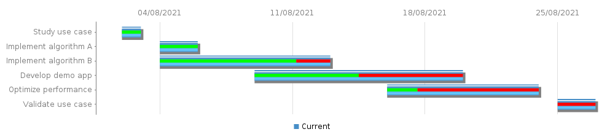
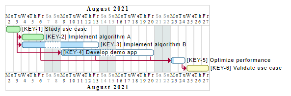

# Jira to Confluence gantt chart generator

[](https://github.com/cledouarec/jira2confluence-gantt/actions/workflows/lint.yaml)
[](https://github.com/cledouarec/jira2confluence-gantt/actions/workflows/test.yaml)

**Table of Contents**
* [Overview](#Overview)
* [Installation](#Installation)
* [Usage](#Usage)
* [Configuration](#Configuration)
    * [Server configuration](#Server-configuration)
    * [Project configuration](#Project-configuration)

## Overview

This module has the objective to create a gantt chart from Jira data and
publish and publish the resulting chart and status on Confluence.
It provides different render engines, but it is easy to add its own custom
engine :



## Installation

### From PyPI (Recommended)

You can install the exporter easily with the following command or insert into
your requirements file :
```
pip install jira2confluence-gantt
```

### From sources

It is recommended to use a virtual environment :
```
python -m venv venv
```
To install the module and the main script, simply do :
```
pip install .
```
For the developers, it is useful to install extra tools like :
* [pre-commit](https://pre-commit.com)
* [pytest](http://docs.pytest.org)

These tools can be installed with the following command :
```
pip install .[dev]
```
The Git hooks can be installed with :
```
pre-commit install
```
The hooks can be run manually at any time :
```
pre-commit run --all-file
```

## Usage

The script with required argument can be started by executing the following
command :
```
./jira2confluence-gantt my_config.yaml
```

The full list of arguments supported can be displayed with the following
helper :
```
./jira2confluence-gantt.exe -h
usage: jira2confluence-gantt [-h] [-v] [--user ATLASSIAN_USER]
                             [--password ATLASSIAN_PASSWORD]
                             [config.yaml]

positional arguments:
  config.yaml           Configuration file

optional arguments:
  -h, --help            show this help message and exit
  -v, --verbose         Verbose mode
  --user ATLASSIAN_USER
                        Define the user to connect to Atlassian server
  --password ATLASSIAN_PASSWORD
                        Define the password to connect to Atlassian server
```

## Configuration

The configuration file support 2 formats :
- [YAML format](https://yaml.org) (Recommended format)
- [JSON format](https://www.json.org)

In the configuration file, there are 2 main sections required :
- Server
- Projects

### Server configuration

The **Server** node will configure the URL of the Jira and Confluence server.
For the moment, only the username/password authentication is supported but only
in the command line for security reason.

**_In Yaml :_**
```yaml
Server:
  Jira: "https://my.jira.server.com"
  Confluence: "https://my.confluence.server.com"
```
**_In Json :_**
```json
{
  "Server": {
    "Jira": "https://my.jira.server.com",
    "Confluence": "https://my.confluence.server.com"
  }
}
```

#### Server

Main configuration node for server.  
**It is a mandatory field.**

#### Jira

Define the Jira server URL to retrieve tickets information to construct Gantt
chart.  
**It is a mandatory field.**

#### Confluence

Define the Confluence server URL to publish the report.  
**It is an optional field. If the confluence server isn't set, only the gantt
chart will be generated if the engine permit it.**

### Project configuration

The `Projects` node will provide the configuration for each project.

**_In Yaml :_**
```yaml
Projects:
  <Project name>:
    JQL: "project = TEST"
    Report:
      Engine: "PlantUML" # Confluence
      Model: "report.jinja2"
    Fields:
      Start date: "Start date (WBSGantt)"
      End date: "Finish date (WBSGantt)"
      Progress: "Progress (WBSGantt)"
```
**_In Json :_**
```json
{
  "Projects": {
    "<Project name>": {
      "JQL": "project = TEST",
      "Report": {
        "Engine": "PlantUML",
        "Model": "report.jinja2"
      },
      "Fields": {
        "Start date": "Start date (WBSGantt)",
        "End date": "Finish date (WBSGantt)",
        "Progress": "Progress (WBSGantt)"
      }
    }
  }
}
```

#### Projects

Main configuration node for all projects.  
**It is a mandatory field.**

#### \<Project name\>

Must be replaced by the name of the project. It is a mandatory field.
This name will be used as a title in the Gantt chart and also as a name in
Snake case format for the output gantt file.

For example, the following configuration could produce an output file
*My_important_project.svg* :

**_In Yaml :_**
```yaml
Projects:
  My important project:
    JQL: "project = TEST"
  # ...
```
**_In Json :_**
```json
{
  "Projects": {
    "My important project": {
      "JQL": "project = TEST"
    }
  }
}
```

#### JQL

In order to retrieve the list of tickets to construct the Gantt chart, Jira
provides a convenient syntax the [JQL](https://www.atlassian.com/blog/jira-software/jql-the-most-flexible-way-to-search-jira-14).  
**It is a mandatory field.**

Some fields could use double quotes to preserve space in their names. The YAML
syntax provides a solution by replacing with simple quote or escaping like
JSON :

**_In Yaml :_**
```yaml
JQL: 'project = "MY TEST"'
```
**_In Json :_**
```json
{
  "JQL": "project = \"MY TEST\""
}
```

#### Report

For each project, the `Report` node must be defined to defined how it is
generated.
**It is a mandatory field.**

#### Engine

There are several engines available to produce Gantt chart :
- `Confluence` chart macro : Produce a chart with a builtin macro. The graph
  will not include the dependency link.
- `PlantUML` macro : Produce a PlantUML graph which will be included in the
  Confluence page with the PlantUML macro.


**It is an optional field. The `Confluence` engine will be used by default.**

**_In Yaml :_**
```yaml
Report:
  Engine: "PlantUML"
```
**_In Json :_**
```json
{
  "Report": {
    "Engine": "PlantUML"
  }
}
```

#### Space

The `Space` attribute is used to defined the Confluence destination space.
**It is a mandatory field.**

**_In Yaml :_**
```yaml
Report:
  Space: "SPACE"
```
**_In Json :_**
```json
{
  "Report": {
    "Space": "SPACE"
  }
}
```

#### Parent page

The `Parent page` attribute is used to define the Confluence parent page of the
report page.
**It is a mandatory field.**

**_In Yaml :_**
```yaml
Report:
  Parent page: "My Parent Page"
```
**_In Json :_**
```json
{
  "Report": {
    "Parent page": "My Parent Page"
  }
}
```

#### Model (Not implemented yet)

The `Model` template is a filename written with [Jinja2](https://jinja.palletsprojects.com/en/3.0.x/).
It will define how the Confluence page will be rendered.
The template uses [Confluence Wiki Markup](https://confluence.atlassian.com/doc/confluence-wiki-markup-251003035.html).

**It is an optional field. the template contains only the Gantt chart.**

**_In Yaml :_**
```yaml
Report:
  Engine: "PlantUML"
  Model: "report.jinja2"
```
**_In Json :_**
```json
{
  "Report": {
    "Engine": "PlantUML",
    "Model": "report.jinja2"
  }
}
```

#### Fields

Configuration node for all Jira fields used to construct Gantt chart.  
**It is a mandatory field.**

**_In Yaml :_**

These fields are most of the time the same for all projects and like all others
fields they could be aliased to avoid redefinition.  
In the following example, we define an anchor `WbsFields` :
```yaml
Server:
  # ...

Fields: &WbsFields
  Start date: "Start date (WBSGantt)"
  End date: "Finish date (WBSGantt)"
  Progress: "Progress (WBSGantt)"

Projects:
  Project name:
    JQL: "project = TEST"
    Fields: *WbsFields
  Second project name:
    JQL: "project = TEST2"
    Fields: *WbsFields
```

**_In Json :_**
```json
{
  "Projects": {
    "Project name": {
      "Fields": {
        "Start date": "Start date (WBSGantt)",
        "End date": "Finish date (WBSGantt)",
        "Progress": "Progress (WBSGantt)",
      }
    }
  }
}
```

#### Start date

Define the Jira field to use as a start date for task in Gantt chart.  
**It is a mandatory field.**

#### End date

Define the Jira field to use as a start date for task in Gantt chart.    
**It is a mandatory field.**

#### Progress

Define the Jira field to use as a percent of work done for task in Gantt chart.    
**It is an optional field.**

#### Link

Define the Jira inward link to use in order to define how the tasks could be
blocked by others tasks task in Gantt chart. 
**It is an optional field. By default, the link used is "is blocked by"**
